# Biểu đồ Use Case - AI Service (Mermaid)

```mermaid
graph TB
    subgraph Actors[" "]
        Backend["Backend Service<br/>(Node.js)"]
        Admin["Data Scientist<br/>/ Admin"]
        System["System"]
    end

    subgraph API["API Layer (FastAPI)"]
        UC1["UC1: Classify Single<br/>Expense"]
        UC2["UC2: Classify Batch<br/>Expenses"]
        UC3["UC3: Health Check"]
        UC4["UC4: Load Models<br/>on Startup"]
    end

    subgraph Core["Core Modules"]
        UC5["UC5: Train Classification<br/>Model"]
        UC6["UC6: Test Model<br/>Interactively"]
        UC7["UC7: Extract Amount<br/>from Text"]
        UC8["UC8: Preprocess Text<br/>(TF-IDF)"]
        UC9["UC9: Predict Category<br/>& Jar"]
        UC10["UC10: Infer Transaction<br/>Type (INCOME/EXPENSE)"]
        UC11["UC11: Detect<br/>Anomalies"]
        UC12["UC12: Check Budget<br/>Limits"]
    end

    subgraph Data["Data Management"]
        UC13["UC13: Export Expenses<br/>from MongoDB"]
        UC14["UC14: Clean &<br/>Prepare Data"]
        UC15["UC15: Split Train/<br/>Test Data"]
        UC16["UC16: Save Trained<br/>Models"]
        UC17["UC17: Load Trained<br/>Models"]
    end

    %% Backend connections
    Backend -->|"POST /classify-expense"| UC1
    Backend -->|"POST /classify-batch"| UC2
    Backend -->|"GET /health"| UC3

    %% Admin connections
    Admin -->|"Run train_model.py"| UC5
    Admin -->|"Run test_model.py"| UC6
    Admin --> UC13
    Admin --> UC14
    Admin --> UC15
    Admin --> UC16

    %% System connections
    System -->|"Auto-load"| UC4
    System --> UC17

    %% Internal dependencies
    UC1 -.->|"uses"| UC8
    UC1 -.->|"uses"| UC7
    UC1 -.->|"uses"| UC9
    UC1 -.->|"uses"| UC10

    UC2 -.->|"uses"| UC8
    UC2 -.->|"uses"| UC7
    UC2 -.->|"uses"| UC9
    UC2 -.->|"uses"| UC10

    UC5 -.->|"uses"| UC13
    UC5 -.->|"uses"| UC14
    UC5 -.->|"uses"| UC15
    UC5 -.->|"uses"| UC8
    UC5 -.->|"uses"| UC9
    UC5 -.->|"uses"| UC16

    UC6 -.->|"uses"| UC17
    UC6 -.->|"uses"| UC8
    UC6 -.->|"uses"| UC7
    UC6 -.->|"uses"| UC9

    UC9 -.->|"uses"| UC10

    UC11 -.->|"uses"| UC13
    UC12 -.->|"uses"| UC13

    UC4 -.->|"uses"| UC17

    %% Styling
    classDef actorStyle fill:#e1f5ff,stroke:#01579b,stroke-width:2px
    classDef apiStyle fill:#fff3e0,stroke:#e65100,stroke-width:2px
    classDef coreStyle fill:#f3e5f5,stroke:#4a148c,stroke-width:2px
    classDef dataStyle fill:#e8f5e9,stroke:#1b5e20,stroke-width:2px

    class Backend,Admin,System actorStyle
    class UC1,UC2,UC3,UC4 apiStyle
    class UC5,UC6,UC7,UC8,UC9,UC10,UC11,UC12 coreStyle
    class UC13,UC14,UC15,UC16,UC17 dataStyle
```

## Mô tả Use Cases

### API Layer

#### UC1: Classify Single Expense
- **Endpoint**: `POST /classify-expense`
- **Input**: `{description, userId, amount?}`
- **Output**: `{predictedCategory, predictedJarKey, predictedType, confidence, amount}`

#### UC2: Classify Batch Expenses
- **Endpoint**: `POST /classify-batch`
- **Input**: `[{description, userId, amount?}, ...]`
- **Output**: `{results: [...], total, successful}`

#### UC3: Health Check
- **Endpoint**: `GET /health`
- **Output**: `{status, models_loaded}`

#### UC4: Load Models on Startup
- **Trigger**: FastAPI startup event
- **Action**: Auto-load TF-IDF và Classifier models

### Core Modules

#### UC5: Train Classification Model
- **Script**: `train_model.py`
- **Flow**: Export → Clean → Split → Fit TF-IDF → Train NB → Evaluate → Save

#### UC6: Test Model Interactively
- **Script**: `test_model.py` hoặc `demo_test.py`
- **Input**: Expense description
- **Output**: Category, Jar, Confidence, Amount

#### UC7: Extract Amount from Text
- **Module**: `AmountExtractor`
- **Formats**: "150000 đồng", "$150", "150k", "1.5 triệu"

#### UC8: Preprocess Text (TF-IDF)
- **Steps**: Lowercase → Remove punctuation/digits → Remove stopwords → TF-IDF

#### UC9: Predict Category & Jar
- **Model**: Multinomial Naive Bayes
- **Output**: Category + Jar Key (NEC, FFA, LTSS, EDU, PLAY, GIVE)

#### UC10: Infer Transaction Type
- **Logic**: Check INCOME categories → Check keywords → Default: EXPENSE

#### UC11: Detect Anomalies
- **Criteria**: Amount > threshold × mean spending
- **Lookback**: 30 days

#### UC12: Check Budget Limits
- **Input**: userId, jarKey, amount
- **Output**: Alert if exceeds limit

### Data Management

#### UC13: Export Expenses from MongoDB
- **Module**: `DataLabelingModule.export_expenses()`

#### UC14: Clean & Prepare Data
- **Module**: `DataLabelingModule.clean_data()`

#### UC15: Split Train/Test Data
- **Module**: `DataLabelingModule.split_train_test()`
- **Ratio**: 80% train / 20% test

#### UC16: Save Trained Models
- **Files**: `tfidf_vectorizer.pkl`, `classifier_nb.pkl`, `classifier_nb_metadata.json`

#### UC17: Load Trained Models
- **Module**: `ExpenseClassifier.load()`

